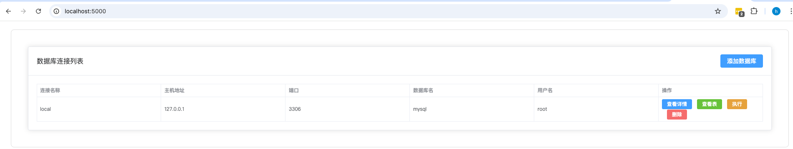
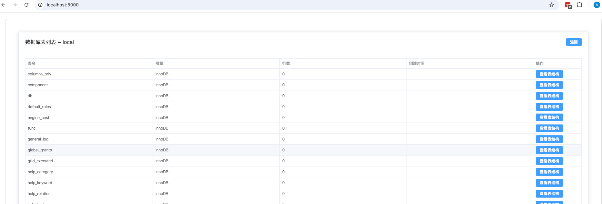
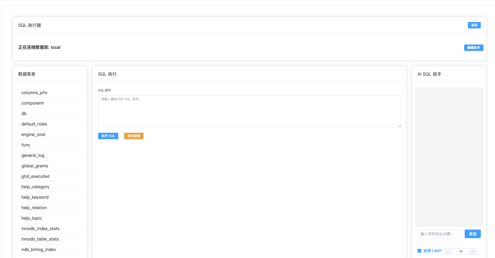
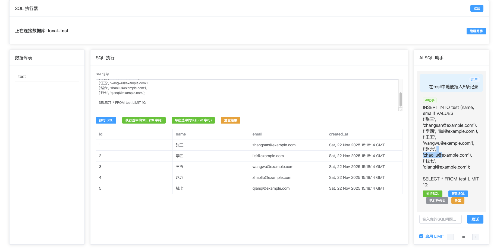
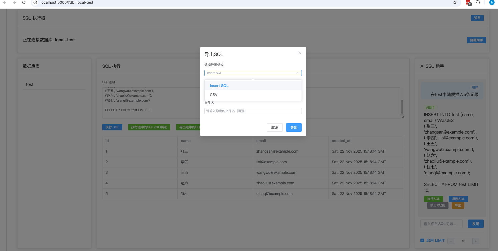

# sql-connecter
MySQL数据库管理服务器，后端使用Python，前端使用Vue

## 功能特性

- 管理多个MySQL数据库连接配置
- 添加、删除、更新数据库连接
- 测试数据库连接
- 查看数据库中的所有表
- 查看特定表的结构信息
- 执行SQL语句（支持SELECT和非SELECT语句）
- AI辅助SQL编写
- 导出数据功能

## 项目结构

```
.
├── README.md              # 项目说明文档
├── backend/               # 后端服务目录
│   ├── __init__.py
│   ├── app.py             # Flask应用主入口
│   ├── database_manager.py # 数据库管理逻辑
│   ├── config.json        # 数据库配置文件（JSON格式）
│   ├── requirements.txt   # Python依赖包列表
│   └── API_DOCUMENTATION.md # API接口文档
├── front/                 # 前端应用目录
│   ├── index.html         # 入口HTML文件
│   ├── package.json       # 项目依赖配置
│   ├── vite.config.js     # Vite构建配置
│   └── src/               # 源代码目录
│       ├── App.vue        # 应用根组件
│       ├── main.js        # 入口文件
│       └── components/    # 组件目录
└── doc/                   # 项目文档和截图
```

## 安装和运行

### 环境要求

- Python 3.6+
- Node.js 14+
- MySQL数据库服务器

### 后端安装和运行

```bash
cd backend
pip install -r requirements.txt
python app.py
```
服务将运行在 `http://localhost:5000`

### 前端安装和运行

```bash
cd front
npm install
npm run dev
```
前端开发服务器将在 `http://localhost:5000` 运行

## 使用说明

1. 首先添加数据库连接配置：
   ```bash
   curl -X POST http://localhost:5000/api/databases \
     -H "Content-Type: application/json" \
     -d '{
       "name": "mydb",
       "host": "localhost",
       "port": 3306,
       "database": "testdb",
       "user": "root",
       "password": "password"
     }'
   ```

2. 查看所有数据库配置：
   ```bash
   curl http://localhost:5000/api/databases
   ```

3. 获取特定数据库中的表列表：
   ```bash
   curl http://localhost:5000/api/databases/mydb/tables
   ```

4. 执行SQL语句：
   ```bash
   curl -X POST http://localhost:5000/api/databases/mydb/execute \
     -H "Content-Type: application/json" \
     -d '{
       "sql": "SELECT * FROM users LIMIT 10"
     }'
   ```

## API文档

完整的API接口文档请查看 [API_DOCUMENTATION.md](backend/API_DOCUMENTATION.md)

## 配置文件说明

配置信息存储在 `config.json` 文件中，格式如下：
```json
{
  "databases": [
    {
      "name": "string",
      "host": "string",
      "port": integer,
      "database": "string", 
      "user": "string",
      "password": "string"
    }
  ]
}
```

## 注意事项

- 密码信息会以明文形式存储在配置文件中
- 建议根据实际需要添加认证和安全措施
- 支持的SQL语句包括SELECT、INSERT、UPDATE、DELETE等

## 需要优化的功能点

### 1. 数据库连接与表创建流程优化

目前用户添加数据库连接后，如果该数据库中还没有建表，
则需要先手动执行建表语句才能使用相关功能。为了解决这个问题，
系统应当提供以下增强功能：

- 添加一个"初始化数据库"按钮或选项
- 可以在添加新数据库时自动检测是否存在表结构
- 提供创建示例表的功能，以便用户快速体验

### 2. 数据库表刷新机制优化

前端界面中显示的数据库表列表，在某些操作后不会自动更新，
这给用户带来了不便。建议增加以下功能：

- 在数据库表区域添加一个"刷新"按钮
- 用户点击后可以手动获取最新的表结构信息
- 在执行SQL语句（特别是DDL语句）后，能够触发自动刷新

## 项目截图







## 开发说明

### 后端开发

后端使用Python Flask框架实现RESTful API服务。
数据库管理逻辑在 `database_manager.py` 中定义，
支持MySQL连接管理和SQL执行等功能。

### 前端开发

前端基于Vue 3和Vite构建，使用Element Plus作为UI组件库。
主要功能页面包含：
- 数据库连接配置管理
- 表结构浏览和查看
- SQL语句执行器（含AI助手）
- 导出功能

## 贡献指南


# 需要优化的点

- 添加数据库时，如果没有这个数据库先要执行建表语句然后在添加数据库
- 数据库表旁边需要添加刷新按钮，刷新表的列表
- 批量添加数据库功能
