# SQL Connector

A web-based MySQL database management tool with both backend API and frontend interface.

## Features

- Manage multiple MySQL database connections
- Add, delete, and update database connection configurations
- Test database connections
- View all tables in a database
- View structure information of specific tables
- Execute SQL statements (supporting SELECT and non-SELECT statements)
- AI-assisted SQL writing
- Data export functionality
- CSV import functionality with batch processing support

## Project Structure

```
.
├── README.md              # Project documentation
├── backend/               # Backend service directory
│   ├── __init__.py
│   ├── app.py             # Flask application main entry point
│   ├── database_manager.py # Database management logic
│   ├── config.json        # Database configuration file (JSON format)
│   ├── requirements.txt   # Python dependency list
│   └── API_DOCUMENTATION.md # API documentation
├── front/                 # Frontend application directory
│   ├── index.html         # Entry HTML file
│   ├── package.json       # Project dependencies configuration
│   ├── vite.config.js     # Vite build configuration
│   └── src/               # Source code directory
│       ├── App.vue        # Application root component
│       ├── main.js        # Entry file
│       └── components/    # Components directory
└── doc/                   # Project documentation and screenshots
```

## Installation and Running

### Prerequisites

- Python 3.6+
- Node.js 14+
- MySQL database server

### Backend Installation and Running

```bash
cd backend
pip install -r requirements.txt
python app.py
```
The service will run at `http://localhost:5000`

### Frontend Installation and Running

```bash
cd front
npm install
npm run dev
```
Frontend development server will run at `http://localhost:5000`

## Usage Instructions

1. First, add a database connection configuration:
   ```bash
   curl -X POST http://localhost:5000/api/databases \
     -H "Content-Type: application/json" \
     -d '{
       "name": "mydb",
       "host": "localhost",
       "port": 3306,
       "database": "testdb",
       "user": "root",
       "password": "password"
     }'
   ```

2. View all database configurations:
   ```bash
   curl http://localhost:5000/api/databases
   ```

3. Get table list from a specific database:
   ```bash
   curl http://localhost:5000/api/databases/mydb/tables
   ```

4. Execute SQL statements:
   ```bash
   curl -X POST http://localhost:5000/api/databases/mydb/execute \
     -H "Content-Type: application/json" \
     -d '{
       "sql": "SELECT * FROM users LIMIT 10"
     }'
   ```

## API Documentation

Complete API documentation can be found in [API_DOCUMENTATION.md](backend/API_DOCUMENTATION.md)

## Configuration File Explanation

Configuration information is stored in the `config.json` file with the following format:
```json
{
  "databases": [
    {
      "name": "string",
      "host": "string",
      "port": integer,
      "database": "string", 
      "user": "string",
      "password": "string"
    }
  ]
}
```

## Important Notes

- Password information is stored in plain text in the configuration file
- It's recommended to add authentication and security measures as needed
- Supported SQL statements include SELECT, INSERT, UPDATE, DELETE etc.

## Project Screenshots

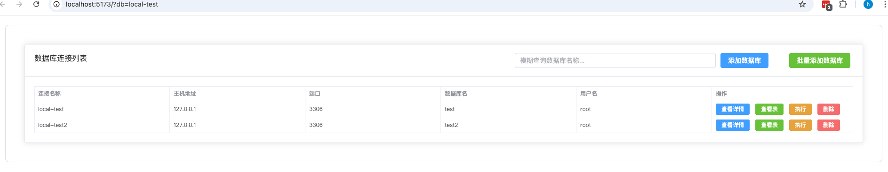
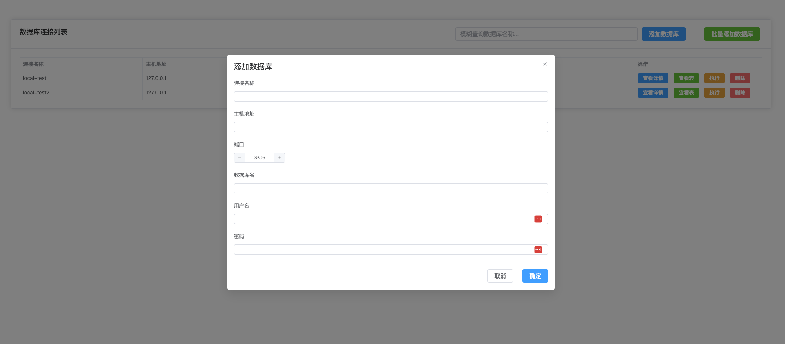
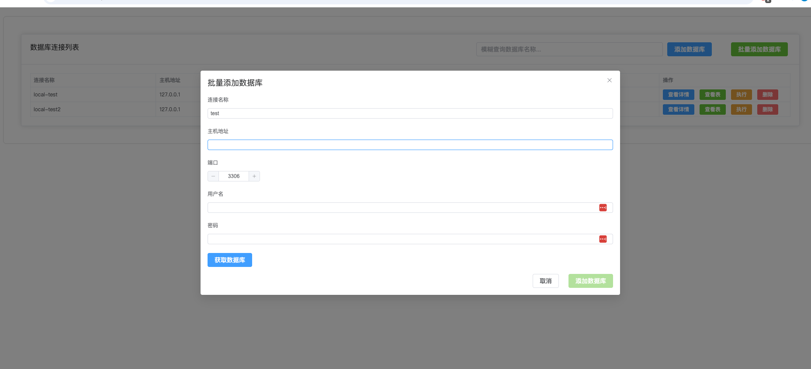
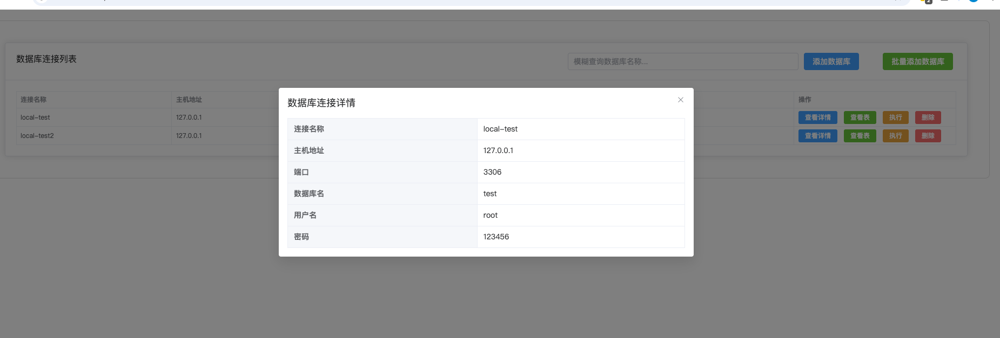
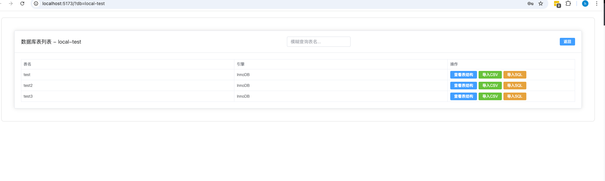
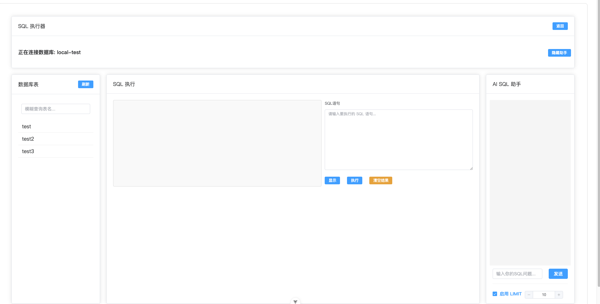
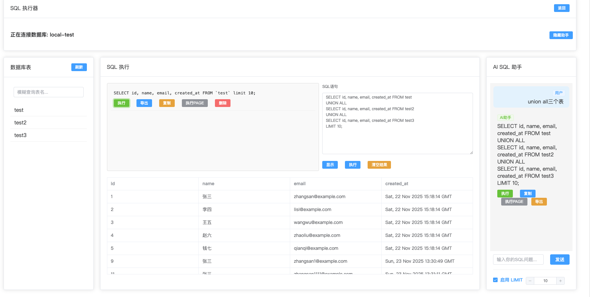
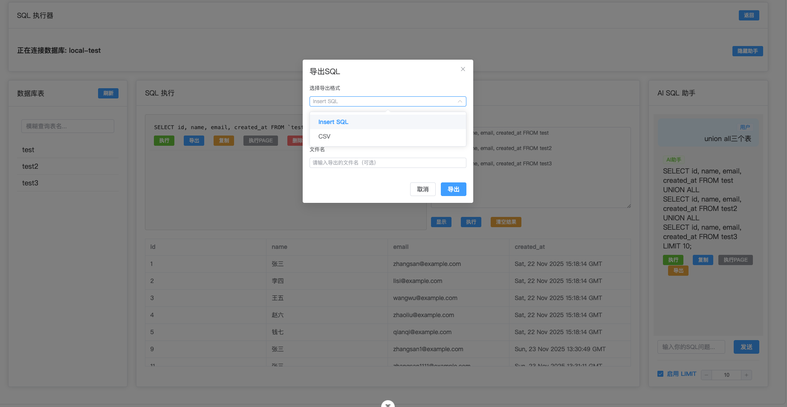
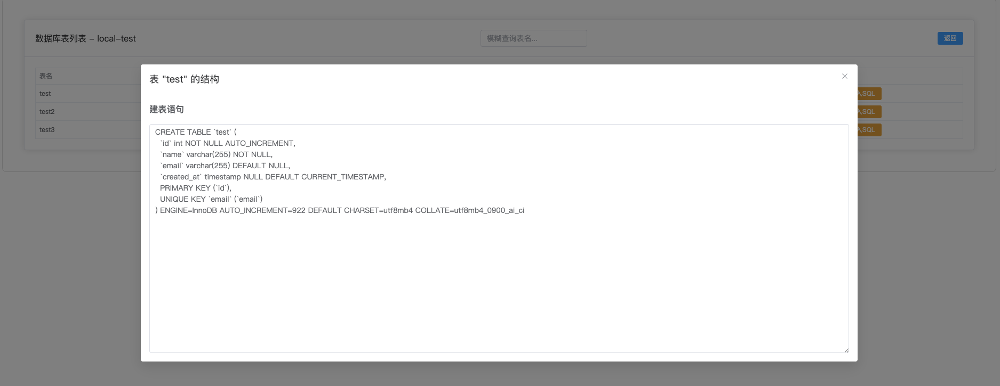
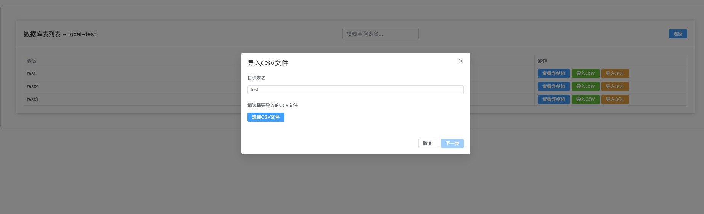

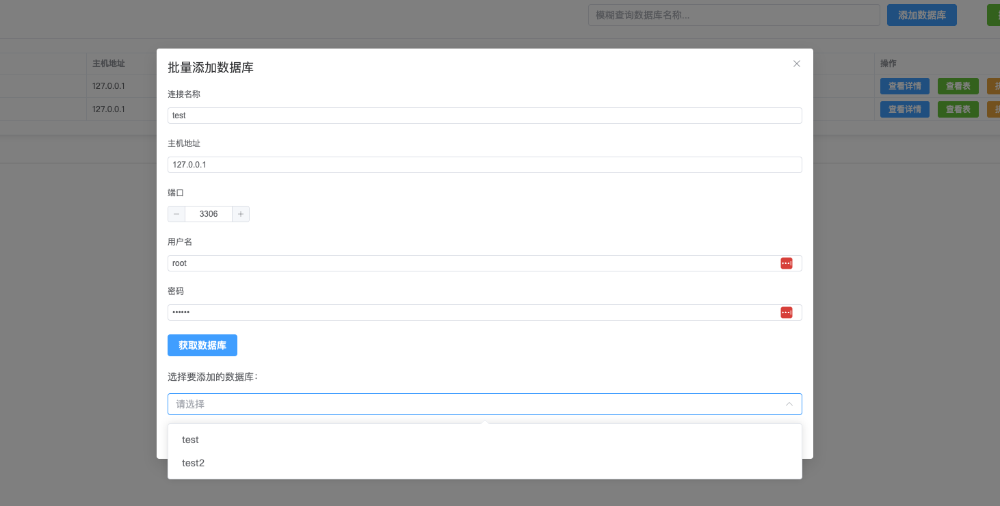


### Backend Development

The backend is implemented using the Python Flask framework to provide RESTful API services.
Database management logic is defined in `database_manager.py`,
supporting MySQL connection management and SQL execution.

### Frontend Development

The frontend is built with Vue 3 and Vite, utilizing Element Plus as UI component library.
Key functional pages include:
- Database connection configuration management
- Table structure browsing and viewing
- SQL statement executor (with AI assistant)
- Export functionality

## Contributing

Contributions are welcome! Please feel free to submit a Pull Request.

## License

This project is licensed under the Apache License, Version 2.0 (the "License"); you may not use this file except in compliance with the License. You may obtain a copy of the License at

http://www.apache.org/licenses/LICENSE-2.0
